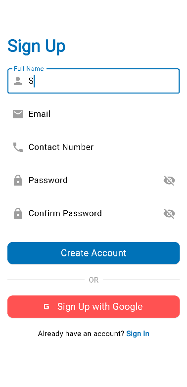
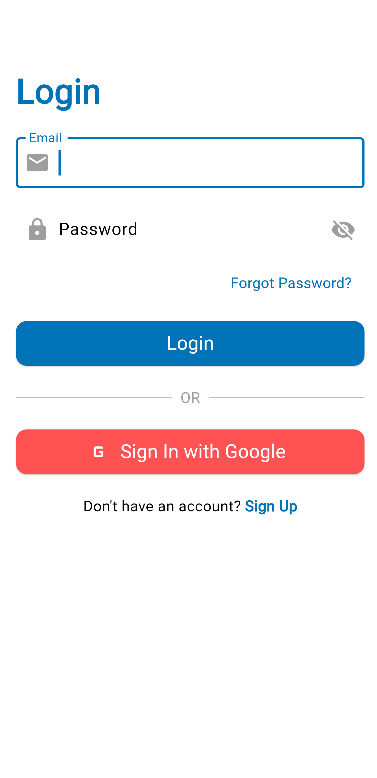

# Flutter Firebase Auth (with GetX)

This project demonstrates Firebase authentication in Flutter using GetX. It includes features for email/password signup, login, Google Sign-In, and Firebase CLI configurations for Android, iOS, and web.

---

## Features

- **Email & Password Authentication**
- **Google Sign-In**
- **State Management using GetX**
- **Responsive Design for Android, iOS, and Web**

---

## Setup Instructions

### Prerequisites

1. Install [Flutter SDK](https://docs.flutter.dev/get-started/install).
2. Install [Firebase CLI](https://firebase.google.com/docs/cli).
3. Create a Firebase project in the [Firebase Console](https://console.firebase.google.com/).

### Steps

1. Clone the repository:
   ```bash
   git clone <repo-url>
   cd <project-folder>
   ```

2. Install dependencies:
   ```bash
   flutter pub get
   ```

3. Configure Firebase for your platforms:

   - **Android**: Add the `google-services.json` file to `android/app`.
   - **iOS**: Add the `GoogleService-Info.plist` file to the `Runner` directory.
   - **Web**: Update `firebase_options.dart` with your web app configuration.

4. Generate SHA keys for Android and add them to Firebase:
   ```bash
   cd android
   ./gradlew signingReport
   ```

5. Run the project:
   ```bash
   flutter run
   ```

---


## Screenshots

### Signup Page


### Login Page


---

## Documentation

### Authentication Flow
1. User signs up using email and password.
2. Firebase verifies and stores user credentials.
3. Users can log in using their credentials or Google Sign-In.

### Exception Handling
- Errors are handled using GetX SnackBars to display user-friendly messages.

---

## Contribution

Contributions are welcome! Feel free to submit a pull request.

---

## License

This project is licensed under the MIT License.
